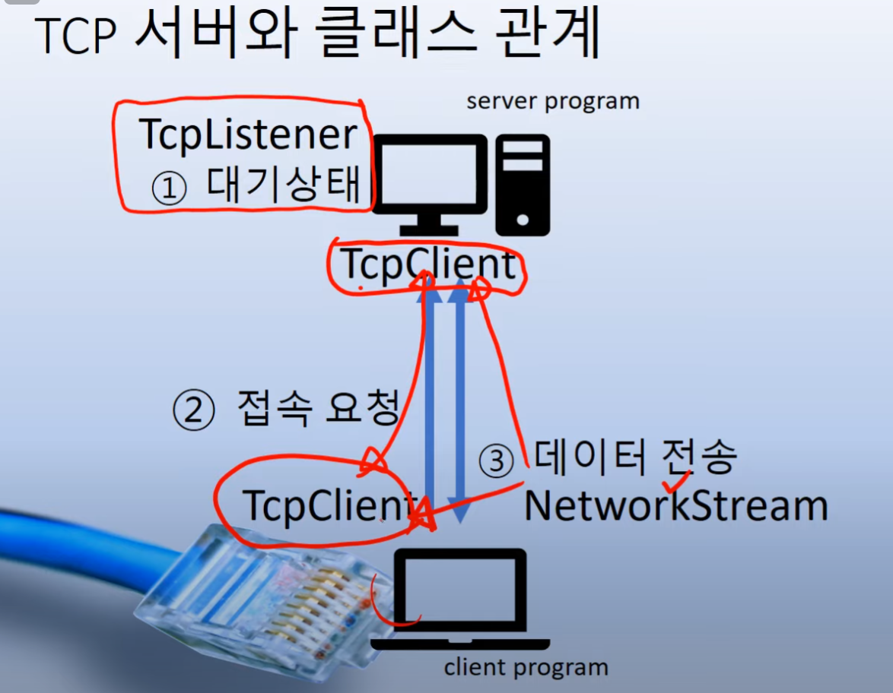
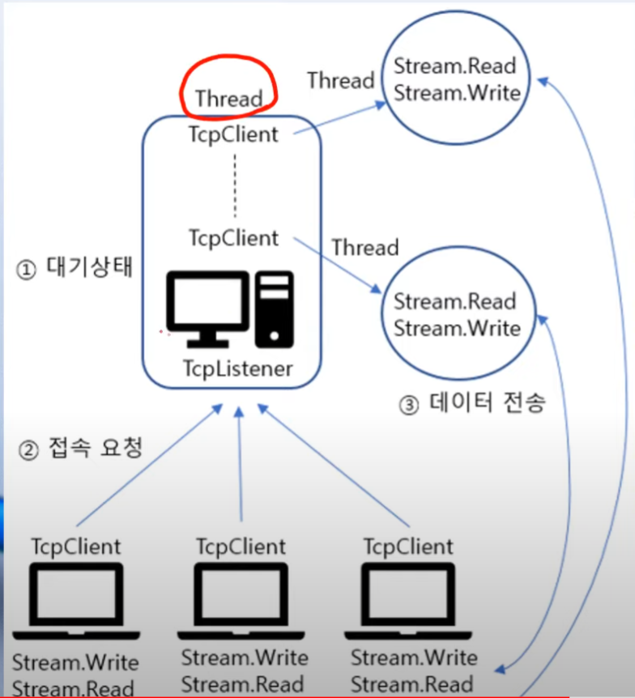

## TCP 서버와 클래스

- TcpListener <br/> 연결과 TcpClient 객체 생성
- TcpClient <br/> 데이터 전송
  - NetworkStream
- 동작방식


.png)
-----
### TcpClient (Server and Client)
| Method      |               description               |
|-------------|:---------------------------------------:|
| Close()     |                TCP 연결 종료                |
| Connect()   |              TCP 서버 연결 시도               |
| GetStream() | 데이터 전송을 수신하는데 사용되는 Network Stream 객체 생성 |
| GetType()   |              현재 객체의 타입 검사               |
| ToString()  |          현재 객체를 String 객체로 변환           |

-----
### TcpListener(Server)
| Method      |               description               |
|-------------|:---------------------------------------:|
| Close()     |                TCP 연결 종료                |
| Connect()   |              TCP 서버 연결 시도               |
| GetStream() | 데이터 전송을 수신하는데 사용되는 Network Stream 객체 생성 |
| GetType()   |              현재 객체의 타입 검사               |
| ToString()  |          현재 객체를 String 객체로 변환           |

-----

## 개요

- 정보 클래스(클래스 지만 구조체 수준)
  - IPAddress : ip 주소 <-> long 형 변환
  - Dns : ip + domain
  - IPHostEntry : ip + hostname
  - IPEndPoint : ip + port
- 연결 클래스 (Socket 기반 (Winsock) )
  - TcpListener
    - 생성자 ip주소 포트번호 설정
    - Start, Stop, AcceptTcpClient(return type : TcpClient)
  - TcpClient
    - 생성자 : ip주소(string hostname) 포트(int port) 설정 => 연결 통로 설정
    - 연결 해제 : TcpClient.Close()
  - UdpClient
  - 생성자 외의 연결 요청 메소드
  ```c#
  public void Connect(IPAddress address, int port)
  public void Connect(IPAddress[] ipAddresses, int port)
  public void Connect(IPEndPoint remoteEP)
  public void Connect(string hostname, int port)
  ```
- 전송 클래스
  - NetworkStream
    - public NetworkStream GetStream()
  - StreamWriter/StreamReader
    - 문자열의 끝에 종결자를 붙여서 보내준다.
    - StreamWriter 생성자
    - 다양한 오버로드 메서드 제공
      - bool, char, double, int, long float, string 등등..
      - MSDN 을 참고하자.
      - virtual 한번만 다시보자 : https://docs.microsoft.com/ko-kr/dotnet/csharp/language-reference/keywords/virtual
      - public virtual void WriteLine(int value)
    - StreamWriter.Close() 로 해제
      - 자동으로 해제 : using 구문을 활용하자
      - using(StreamWriter sw = new StreamWriter(ns)) {...}
    - StreamReader
      - 문자열을 종결자 단위로 읽어낸다 
      - ns에선 일일히 자르던가(직렬화?) , parse
      - public override string ReadLine()
      - 일단은 string, 다른 형식으로 변환
      - return값이 null이면 읽을 것이 없음
      - 이거 덕분에 c/c++에선 구조체로 보내야하는데 이런 불편함을 해소? 공부해야할 부분
      - StreamWriter.AutoFlush : WriteLine 잔여 buffer를 자동적으로 비워주는 method
      - int.parse(str)
  - BinaryWriter/BinaryReader
    - 임의의 데이터형 해석
    - BinaryWriter.Write()
    - one to one 대응으로 float-BinaryReader.ReadSingle()
    - int-BinaryReader.ReadInt32() 등
    - StreamWriter/Reader와의 차이
      - StreamWriter는 데이터를 임시로 자신의 _charBuffer에 저장해두었다가, 
      - Flush() 될 때 BaseStream으로 옮겨담았지만, 
      - BinaryWriter는 Flush()하지 않아도 곧바로 BaseStream에 저장한다.
      - 버퍼 저장 방식의 차이
      - BinaryWriter는 버퍼의 헤더(Prefix)에 길이를 붙인다는 점을 유의해야한다. 
      - 스트림 쓰기를 BinaryWriter로 했다가 
      - 스트림 읽기를 StreamReader로 하면 데이터가 어긋날 수 있다.
-----
https://cho-coding.tistory.com/127
직렬화 (serialize)

- StreamWriter / StreamReader와 BinaryWriter / BinaryReader -> 기본 데이터형만 저장 및 읽기 가능 (float int string 등)

- 구조체, 클래스 저장 및 읽기 -> FileStream, BinaryFormatter

- BinaryFormatter 네임스페이스 -> using System.Runtime.Serialization.Formatters.Binary;

-----
## 데이터 변환 클래스와 메서드

```cs
// System.Text.Encoding 클래스 사용
GetBytes(char[] chars)
GetChars(byte[] bytes)
GetString
```


