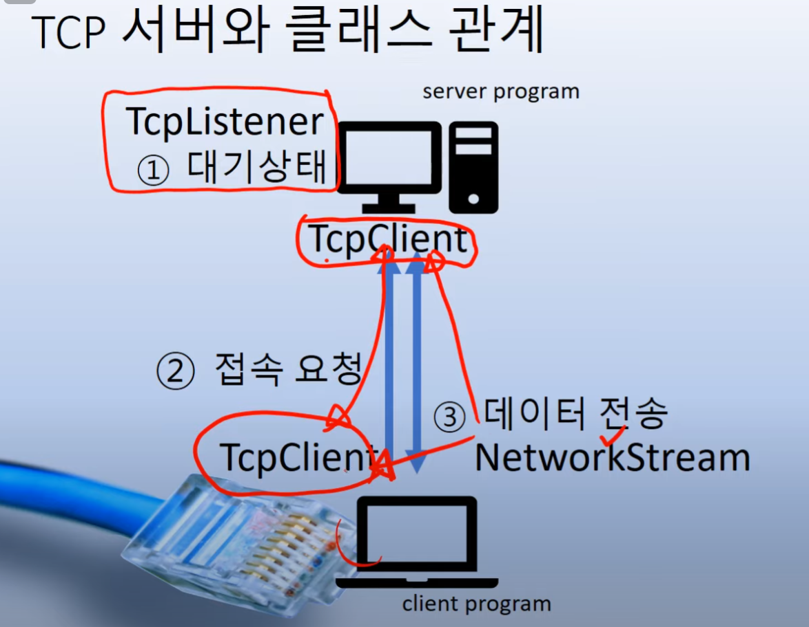
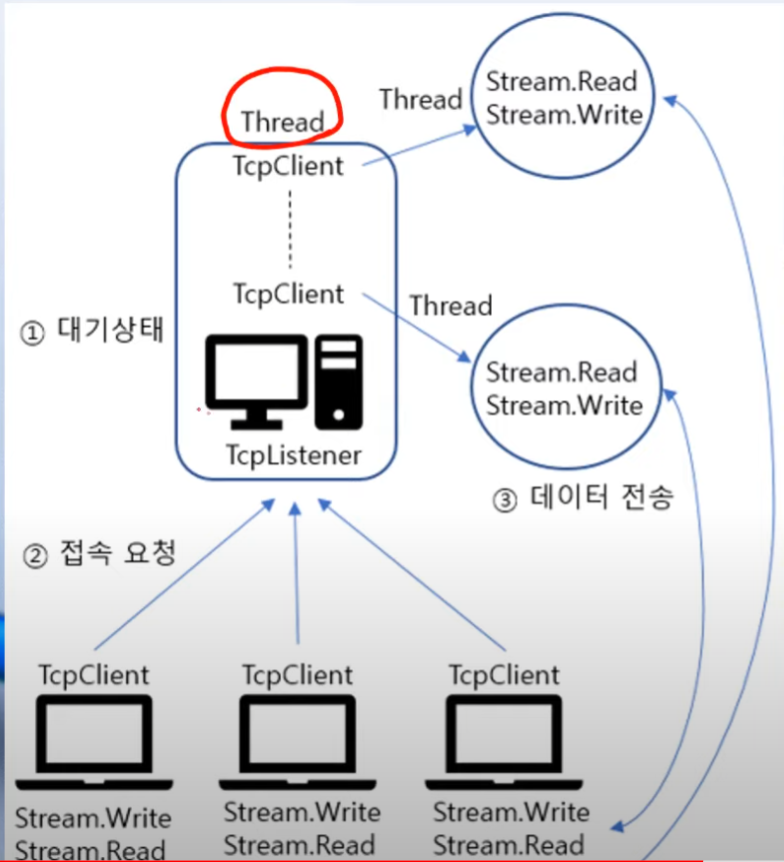

## TCP 서버와 클래스

- TcpListener   연결과 TcpClient 객체 생성
- TcpClient   데이터 전송
  - NetworkStream
- 동작방식

.png)
-----
### TcpClient
| Method      |               description               |
|-------------|:---------------------------------------:|
| Close()     |                TCP 연결 종료                |
| Connect()   |              TCP 서버 연결 시도               |
| GetStream() | 데이터 전송을 수신하는데 사용되는 Network Stream 객체 생성 |
| GetType()   |              현재 객체의 타입 검사               |
| ToString()  |          현재 객체를 String 객체로 변환           |

-----
### TcpListener
| Method      |               description               |
|-------------|:---------------------------------------:|
| Close()     |                TCP 연결 종료                |
| Connect()   |              TCP 서버 연결 시도               |
| GetStream() | 데이터 전송을 수신하는데 사용되는 Network Stream 객체 생성 |
| GetType()   |              현재 객체의 타입 검사               |
| ToString()  |          현재 객체를 String 객체로 변환           |

-----
